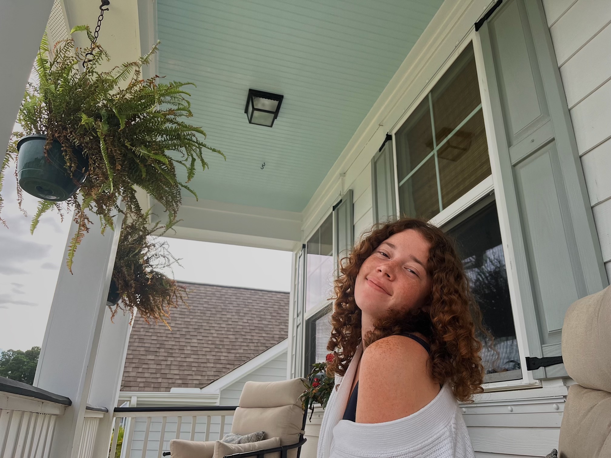
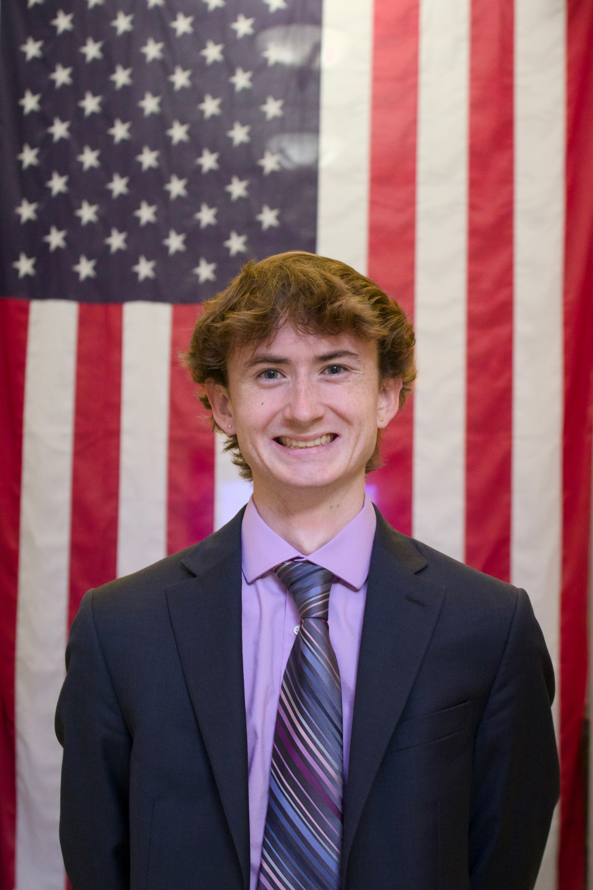
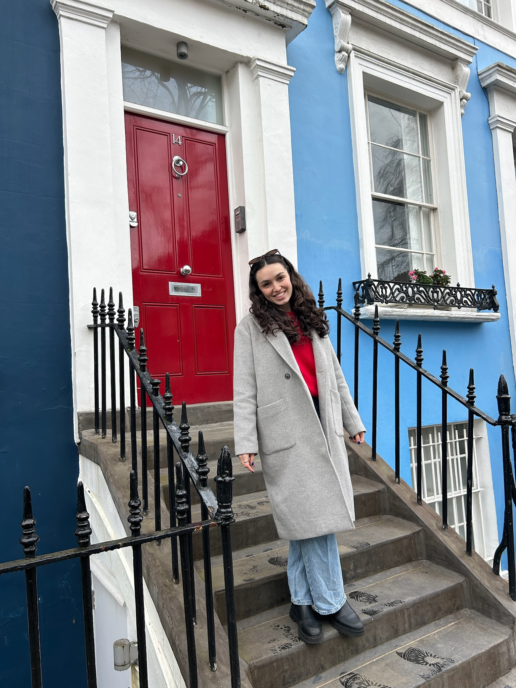
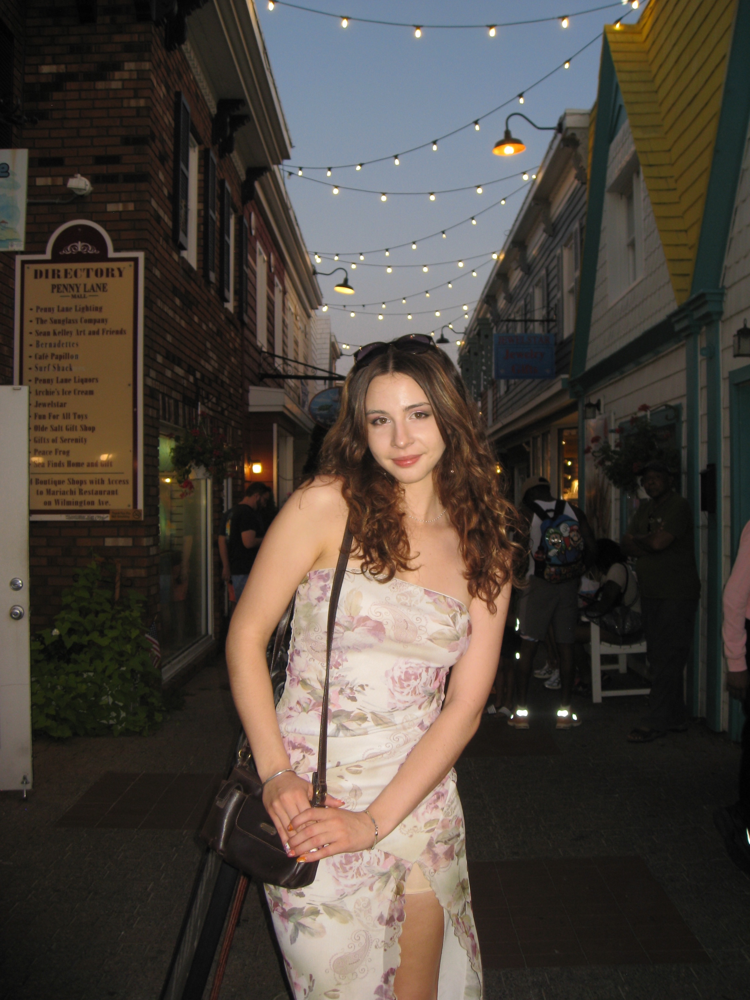
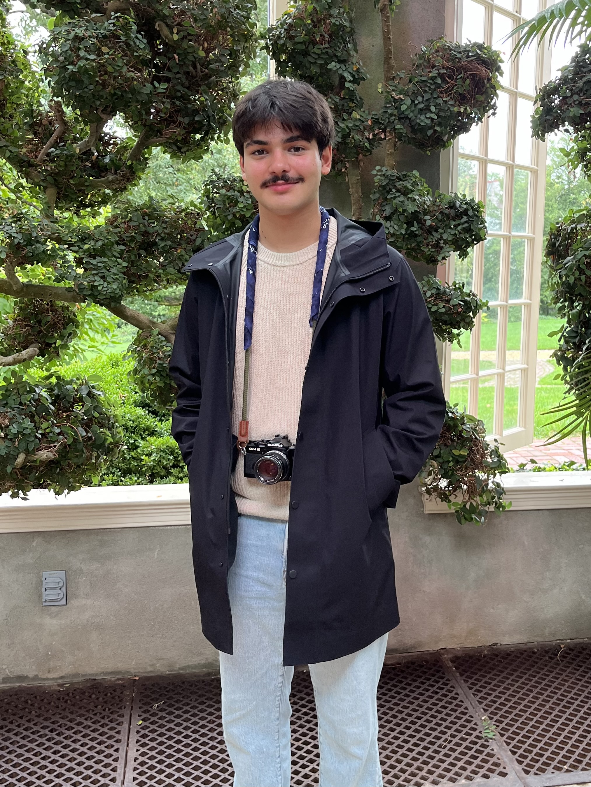
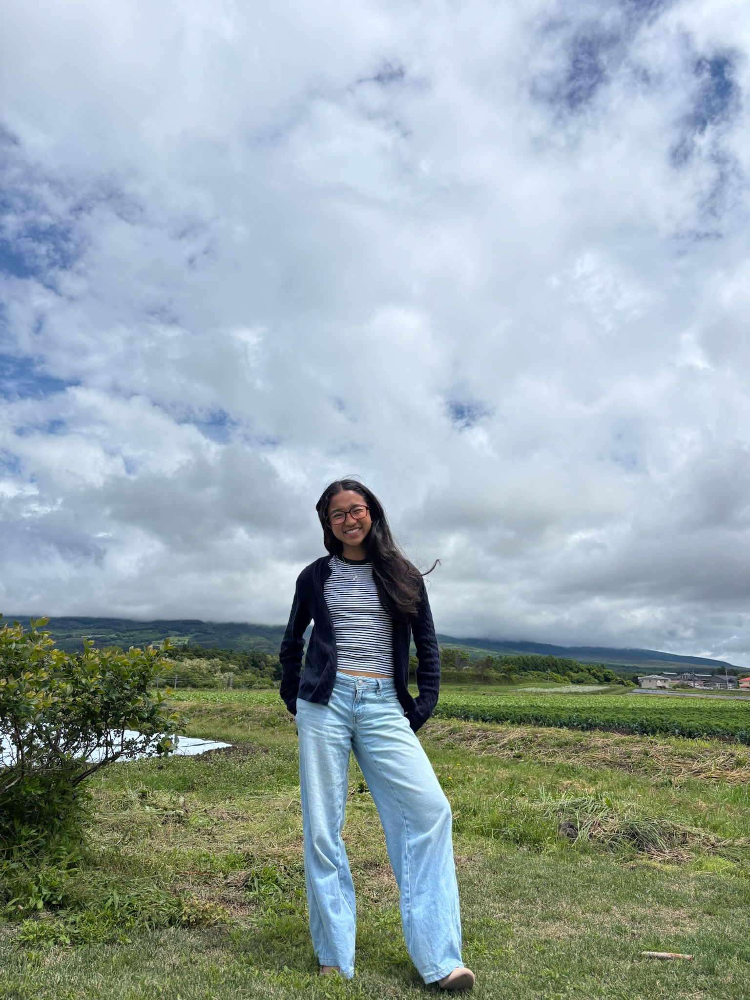

[Home](index.md) | **About** | [Our Projects](projects.md) | [Events](events.md) | [Contact Us](contact.md) | [Gallery](gallery.md) | [Resources](resources.md)

---

## Our Mission
EJAN is a graduate and undergraduate inclusive and intersectional organization that strives to be action-centric on environmental justice issues while also building a coalition of like-minded social justice oriented students that want to make a change in their community.
EJAN empowers its members to translate their knowledge into action by utilizing intersectional frameworks and directly integrating with the broader D.C. community. This goal is realized through the three statutes of EJAN:
 
1. **Action-Oriented Advocacy:** EJAN focuses on tangible ways to create change in our communities by volunteering, writing letters to legislators, and engaging in service opportunities within the broader D.C. community to promote Environmental Justice.
 
2. **Fostering Relationships with Broader D.C. Area:** EJAN focuses on community-based efforts in the D.C. area, and connects EJAN members to community leaders to provide assistance to those who are disproportionately burdened by environmental injustices.
 
3. **Education-Centered:** EJAN expands members’ knowledge about historical and current environmental injustice topics by attending EJ webinars, and discussing relevant literature chosen by EJAN members.

## Meet Our E-board
- **Kaitlyn Gang**, President

>Kaitlyn is a senior studying environmental studies and political science. 
- **Justin Cummings**, Secretary

>Justin is a senior studying environmental science and political science
- **Karina Reddy**, Treasurer

>Karina is a senior studying neuroscience.
- **Serena Finger**, Community Outreach Chair

>Serena is a senior studying environmental studies
- **Jaz Abbey**, Social Media Chair

>Jaz is a senior studying political science.
- **Zane Snyder Cox**, Recruitment Coordinator

>Zane is a senior studying political science.
- **Sonia Lerner**, Transition Liaison

>Sonia is a sophomore studying public health and computer science.
- **Elias Theofilopoulos**, Transition Liaison

>Elias is a sophomore studying environmental studies.
- **Evie Straub**, Transition Liaison

>Evie is a sophomore studying civil engineering
- **Andrew Shayani**, Transition Liaison

>Andrew is a junior studying environmental studies.
- **Ben Jacobs**, Transition Liaison

>Ben is a junior studying environmental studies and political science.
- **Amelia Ogawa**, Transition Liaison

>Amelia is a sophomore studying environmental science.

## Community Partners
We are part of GW's Sustainable Students Coalition, a collective of environment-related orgs, and work closely with GW's Department of Sustainability, GW Students for One Health, Ward 8 Woods, Citizens Climate Lobby (CCL), GW's SEAS Greenhouse, Chesapeake Climate Action Network (CCAN), and GW Surfside to amplify our collective impact.

## Subcomittees

EJAN operates through various subcomittees:
### Policy and Advocacy
[ZANE S]

### Ward 8 Woods Tree Identification Research
In collaboration with Casey Trees, a nonprofit working to restore DC's tree canopy, and Ward 8 Woods, a nonprofit organization dedicated to reducing trash in Ward 8 forests by employing Ward 8 residents themselves, we are surveying trees in Ward 8 to gather information on trees that are at risk of removal. This project involves travelling to Ward 8 and collecting data and then adding that data to a usable GIS interface started by Casey Trees.

### Waste Reduction
[ELIAS T]

### Milken Native Garden
[IDK WHO]

### Book Club
Join us as we read an environmental justice-related book each semester. We are currently reading [current book] by [current author], and have previously read titles such as *Parable of the Sower* by [author], and *Afterglow* by [author].