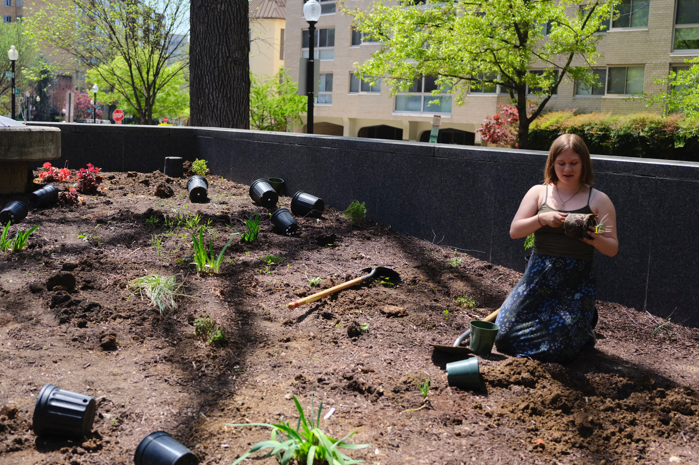

```
/
├── index.md (Home Page)
├── about.md
├── projects.md
├── events.md
├── contact.md
├── gallery.md
└── resources.md
```
## GW EJAN
**Home** | [About](about.md) | [Our Projects](projects.md) | [Events](events.md) | [Contact Us](contact.md) | [Gallery](gallery.md) | [Resources](resources.md)

---

# EJAN: Environmental Justice Action Network
### Advancing Environmental Justice at George Washington University and in greater Washington, DC


*Description: EJAN Logo: Green, black, and white globe with fist and text, "EJAN"*

**EJAN** is a grassroots organization dedicated to ensuring that all communities, regardless of race, income, or geographic location, have equal access to a healthy environment and meaningful participation in environmental decision-making processes.

### What We Do

We work at the intersection of social justice and environmental protection, focusing on communities that have been disproportionately affected by environmental hazards. Through volunteering, policy and advocacy, and research, we strive to create lasting change.

  
*Description: Various images of EJAN members creating change*

### Quick Links
- **[Latest Project Update](projects.md#current-initiatives)** - See our ongoing work in environmental justice
- **[Upcoming Events](events.md)** - Join us at our next general body meeting, subcomittee meeting, book club, or volunteer event!
- **[Get Involved](contact.md)** - We'd love to see you!

### Follow Us
- [**Instagram**](https://www.instagram.com/gw_ejan/)
- [**GW Engage**](https://gwu.campuslabs.com/engage/organization/ejan)
- [**Link Tree**](https://linktr.ee/gw_ejan?fbclid=PAZXh0bgNhZW0CMTEAAaeeLjcwGDWIbdivwCwZev_uY15UP8skfEsOlZYx1JQ3EpCvKrPQUulLaiDTWA_aem_bQ1eVrKodqQTY0Hbn5JQxw)